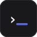

# Typecheck — Minimalist, Private Typing Test

[](LICENSE) [](https://vitejs.dev) [](https://react.dev) [](#) [](#)

> **Practice, race & compete — 100% local, no ads, no tracking. Your data never leaves your browser.**



**Live demo:** `https://typecheck.test` (or `npm run dev` → `http://localhost:5173`)

---

## Why Typecheck?

**I recommend open-sourcing this — here’s why, as requested:**

- **Trust:** Typing data is sensitive. Open source + `localStorage only` (`Privacy-first · No cookies · Local storage only` in footer) lets anyone audit `src/store/useSettingsStore.ts:36` + `useHistoryStore.ts:13` — no backend.
- **Growth:** Monkeytype clones grow via community themes, word lists, code modes. Your `Race (free/private + limit/passcode + BroadcastChannel)` and `Weak-Key Coach` are unique — contributors will amplify.
- **Moat:** Keep core **MIT**, add `PRO` badge as *cosmetic* (no paywall). Monetize later via **hosted teams** (`typecheck.test/teams`) without closing core.

**If you keep it closed:** you pay for trust. If open: you gain distribution. For a typing test, distribution > secrecy.

---

## Features (all local, no login)

| Area | What’s inside |
|---|---|
| **Test** | `time (15/30/60/120)`, `words (10/25/50/100)`, `quote`, `zen`, `custom` + `GitHub paste` (`TypingArea.tsx:53` syntax-aware `getTokenStyle`), `english/code`, `punctuation/numbers`, `blind/stopOnWord`, `caret line/block/underline`, `font 16–36`, `sound mechanical + chime` (split toggles) |
| **Engine** | `WPM = (correct/5)/(min)`, `raw`, `accuracy`, `consistency`, `burst`, `charErrorMap/bigramErrorMap` (`stats.ts:22`, `TypingArea.tsx:162`) |
| **Weak-Key Coach** | Finger heatmap `QWERTY` + `Top 3 keys/bigrams`, `Drill 25` (`WeakKeyCoach.tsx:51`) → injects into next test |
| **Adaptive Lab** | Auto `words 10↔50` / `time 15↔60` + `punct` when `accuracy <92` or `>97` ×3 (`App.tsx:45`) |
| **Focus/Calm/A11y** | `Focus` (dims chrome, `Esc`/`Exit Focus` floating `data-focus-exit`), `Dyslexia Lexend`, `High-contrast`, `Breathing bar 8s` (`index.css:113`) |
| **Sound** | Real `public/sounds/mech-key.wav` thock `88Hz` + click `0.42` vol, correct `A-major` pop — `HTMLAudio` + `AudioBuffer` pre-warmed, `⌘/Ctrl+S`, header dropdown `Mechanical keys` / `Correct word chime` individually |
| **Race** | `Free` (visible, owner sets `limit 2/4/8/16/32`) + `Private` (visible but `🔒` needs `passcode`) — both visible, limit shown. `BroadcastChannel race-${id}`, `3-2-1` countdown, live WPM/progress, `Copy link (?race=CODE)`, `Assignment` textarea for classroom, `Export race CSV` |
| **Analytics** | `Avg/Best/Accuracy/Consistency` + `WPM trend 20` + `Last run sparkline` + `Finger & Bigram Deep Analytics` (`App.tsx:190`) + table `30` rows, `best` highlight `bg-highlight` |
| **History** | `200` results `localStorage typing-history-v2`, `Export CSV/JSON`, `Import JSON`, `Clear`, `Vocabulary Deck` 30% inject (`useDeckStore.ts`) |
| **PWA** | `vite-plugin-pwa` `autoUpdate`, `manifest` `Typecheck`, `workbox` fonts+ `sounds/*.wav` cached, `theme-color` |
| **A11y/SEO** | `lang, meta, OG, twitter, JSON-LD`, `kbd` styles, `focus-visible`, `aria-label="typing input"` |

Directly usable — open the URL and type. No account. Data in `localStorage` only (`typing-settings-v7`, `typing-history-v2`, `typecraft_deck_v1`, `typecraft_race_rooms_v1`, `typecraft_name`).

---

## Quick Start

```bash
npm install
npm run dev      # http://localhost:5173
npm run build    # tsc -b && vite build → dist/
npm run preview
npm run lint     # oxlint
```

**Keyboard:** `Tab+Enter` / `Enter` restart, `Space` focus/start, `Ctrl/Cmd+Backspace` clear word, `Ctrl/Cmd+S` sound, `Ctrl/Cmd+J` next theme, `Ctrl/Cmd+R` Race, `Ctrl/Cmd+E` Analytics, `?` / `Ctrl+/` shortcuts, `Esc` quit Focus/Tour.

---

## Open Source Promotion (if you launch tomorrow)

**Ready to launch checklist already in repo:**
- `LICENSE` MIT, `CONTRIBUTING.md`, `CODE_OF_CONDUCT.md`, `SECURITY.md`, `.github/ISSUE_TEMPLATE/*`, `.github/pull_request_template.md`
- `README` badges, `manifest.webmanifest`, `og-image.png` placeholder, `sitemap` via `vite build`
- `Privacy-first` footer, `No cookies` — good for Product Hunt / Hacker News “Show HN”

**To promote (agree):**
1. **GitHub:** push to `SarthakKrishak/Typecheck` → enable `Discussions`, `Sponsor` button, pin `Race` demo GIF.
2. **Product Hunt:** `Typecheck — The typing test that stays local` — tag `Privacy`, `Developer Tools`.
3. **Hacker News:** `Show HN: Typecheck — I built a Monkeytype alternative that never sends keystrokes to a server`.
4. **Twitter/Reddit r/typing:** short video of `Ghost` + `Race` + `Weak-Key heatmap`.

I **agree** with open source — for typing, **trust is the feature**. Keep it MIT for launch; you can dual-license `PRO` later.

---

## Contributing

See [CONTRIBUTING.md](CONTRIBUTING.md). `npm run lint` before PR. `typecheck` uses `Instrument Sans / Geist Mono / Lexend` and `Linear`-inspired tokens (`--bg #0A0A0B`, `--primary #5E6AD2`).

## Security

See [SECURITY.md](SECURITY.md). No data leaves browser — report via `hello@typecheck.test`.

## License

MIT © 2026 Typecheck — see [LICENSE](LICENSE).
